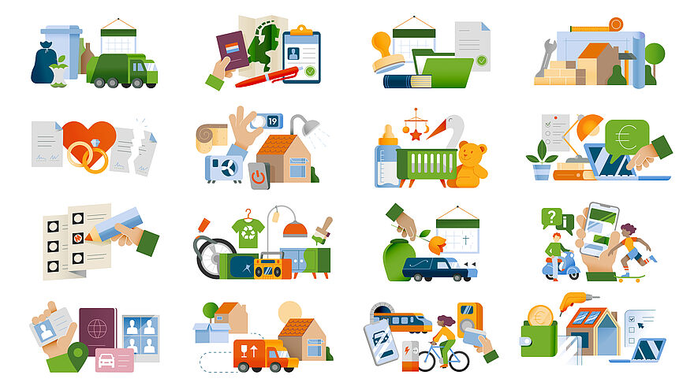

# The Client - Website

Ontwerp en maak een website voor een opdrachtgever en bespreek het resultaat tijdens de Sprint Review.

De instructies van deze leertaak staan in de [WIKI](https://github.com/fdnd-task/the-client-website/wiki).

## Inhoudsopgave Readme

* [Beschrijving](#beschrijving)
* [Kenmerken](#kenmerken)
* [Bronnen](#bronnen)
* [Licentie](#licentie)

## Beschrijving

Voor deze leertaak heb ik een website gemaakt over Gemeenteniconen. De website laat zien hoe gemeenten iconen en illustraties kunnen gebruiken om ingewikkelde informatie begrijpelijker te maken.

Het ontwerp heeft een lichte achtergrond, donkere tekst en gekleurde vlakken met iconen. Bezoekers kunnen voorbeelden bekijken, een illustratie openen en via links naar de GitHub-repository, de documentatie voor webcomponenten of een ZIP-download van de iconenset gaan.

De website past zich aan aan desktop en mobiel. Op mobiel kunnen bezoekers het navigatiemenu openen met een hamburgerknop en met een vaste knop terug naar boven gaan.

[Bekijk de HTML-pagina](./Gemeenteniconen.html)

<!-- Voeg hier de link naar de gepubliceerde website op GitHub Pages toe. -->
<!-- Vervang de illustratie hierboven eventueel door een screenshot van de volledige website. -->

## Kenmerken

De website is gebouwd met HTML, CSS en JavaScript.

HTML: de pagina gebruikt elementen zoals `header`, `nav`, `main`, `section`, `article` en `footer`. Ankerlinks verbinden het menu met onderdelen op de pagina. Afbeeldingen hebben alternatieve teksten.

CSS: CSS Grid bepalen de indeling. Herbruikbare classes zorgen voor rasters, rijen, kolommen en knoppen. CSS-variabelen bevatten de belangrijkste kleuren en `clamp()` maakt koppen flexibel in grootte.

Responsive ontwerp: media queries passen de navigatie, kolommen en afstanden aan voor kleinere schermen. Op mobiel staan de collectiekaarten en gebruiksopties onder elkaar.

JavaScript: de hamburgerknop opent en sluit het mobiele menu door de class `is-open` te wisselen. Daarbij veranderen `aria-expanded` en het toegankelijke label van de knop mee. Zonder JavaScript blijven de navigatielinks zichtbaar.

Toetsenbordbediening: links en knoppen krijgen een zichtbare omlijning met `:focus-visible`.

Afbeeldingen: SVG-bestanden worden gebruikt voor het logo en de iconen; de illustraties zijn rasterafbeeldingen.

De bestanden zijn ingedeeld in:

* `Gemeenteniconen.html`: de inhoud en structuur van de pagina.
* `styles/styles.css`: de vormgeving en responsive indeling.
* `scripts/script.js`: het openen en sluiten van het mobiele menu.
* `assets/`: de afbeeldingen, iconen en het logo.

* hieronder nog wat foto's hoe de pagina eruit ziet op desktop.

 

* Dit is hoe de pagina eruit ziet op mobile.

## Bronnen

* [FDND WIKI – The Client Website](https://github.com/fdnd-task/the-client-website/wiki): de instructies voor deze leertaak.
* [OpenGemeenten Iconenset](https://github.com/OpenGemeenten/Iconenset/): de iconenset waarnaar de website verwijst.
* [Frameless webcomponenten](https://frameless.github.io/iconset-npm/): documentatie voor het gebruiken van de iconen als webcomponenten.
* [OpenGemeenten](https://www.opengemeenten.nl/): informatie over OpenGemeenten.
* [Gemeenteniconen – Rechtenvrij](https://www.gemeenteniconen.nl/rechtenvrij): informatie over het gebruik van de iconen en illustraties.

## Licentie

This project is licensed under the terms of the [MIT license](./LICENSE).
